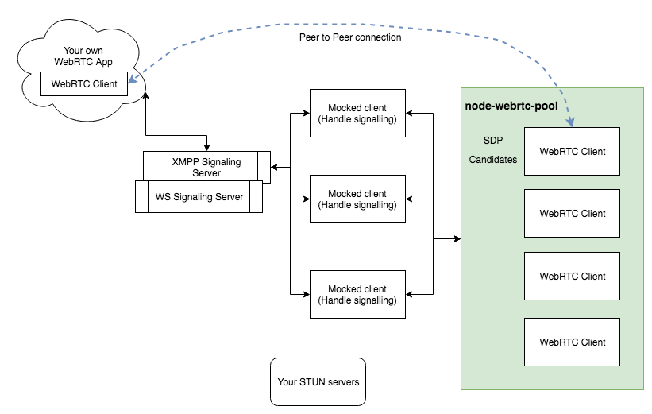

# node-webrtc-pool

[](https://codecov.io/gh/xuanzhaopeng/node-webrtc-pool)
[](https://travis-ci.org/xuanzhaopeng/node-webrtc-pool)

*This project is still in WIP*

It's a tool to manipulate multiple In-Cloud WebRTC clients through Restful Service.

*Thanks very much for the project https://github.com/node-webrtc/node-webrtc.*

> The main purpose of this project is to provide an easy way to **TEST** WebRTC based applications.

It supports to:
* establish peer connection without Browser nor native audio/video device
* create multiple sessions which represent WebRTC client respectively
* configure different WebRTC client with different configurations
* set fake audio/video stream by feature `getUserMedia` provided https://github.com/node-webrtc/node-webrtc/releases/tag/v0.3.1
* create offer / answer
* set local/remote sdp
* set remote candidates
* set received track strategy, such as loop back the received stream

## Scenario in real practice



In above figure, a mocked client could be seen as your own custom library which could handling the Signaling process, so you could have many instances of `MockedClient`, each mocked client could create a session from node-webrtc-pool, so now it means each mocked client already has WebRTC feature, such as accept or make a VOIP call.

It means your mocked client could be in any language, such as Scala, Java, Ruby, Python extra.

So it means, with help of node-webrtc-pool:
* You could make E2E calling test based on Appium/Selenium + node-webrtc-pool
* You could test your STUN/TURN server without any help of your Frontend app.
* You could run test against in your PRODUCTION environment to monitor your STUN/TURN server in real time 

## Play with it
> I'm gonna make it as a docker image soon

Understand endpoints:
```
https://editor.swagger.io/?url=https://raw.githubusercontent.com/xuanzhaopeng/node-webrtc-pool/master/swagger/swagger.json
```

From source code
```bash
$ git clone https://github.com/xuanzhaopeng/node-webrtc-pool
$ npm install

# Run tests
$ npm run test

# Start service
$ npm run start
```

Then open following link to try endpoints
```
http://localhost:3000/api-docs
```
